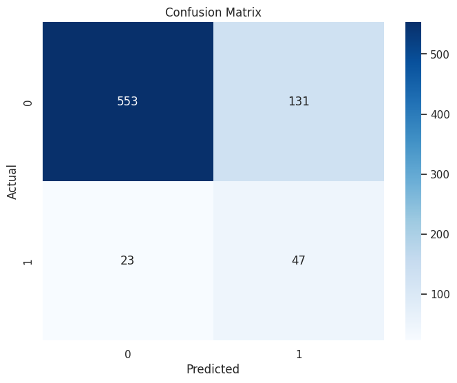
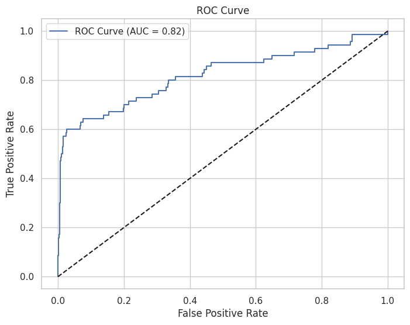

# Fraud Detection in Bank Transactions - STATS202 Homework 4
*Duke Kunshan University STATS 202 HW3*

## Project Overview
This project implements a logistic regression model to detect fraudulent bank transactions as part of Duke Kunshan University's STATS202 coursework. The solution follows a complete machine learning workflow from data exploration to model deployment.

## Key Features
- **Data Analysis**: Comprehensive EDA with visualizations of transaction patterns
- **Feature Engineering**: Created predictive features like:
  - `AmountToBalanceRatio`
  - `UnusualLoginAttempts`
  - `IsNightTime` 
- **Model Development**: Compared two logistic regression variants:
  - Baseline model
  - Feature-selected model (better performance)
- **Evaluation**: Detailed metrics including:
  - Confusion matrices
  - ROC curves (AUC: 0.82)
  - Feature importance analysis

## Insights

  

  <em>Figure 1: Confusion Matrix.</em>

  

  <em>Figure 2: ROC Curve.</em>

## Results Summary
| Metric               | Basic Model | Feature-Selected Model |
|----------------------|-------------|------------------------|
| ROC AUC              | 0.819       | 0.824                  |
| Fraud Recall         | 67%         | 69%                    |
| Fraud Precision      | 26%         | 29%                    |

## How to Use
1. Clone repository
2. Install requirements:  
   `pip install -r requirements.txt`
3. Run Jupyter notebook:  
   `jupyter notebook STATS202-HW4-Fraud-Detection.ipynb`
   
## Key Findings
- Best model achieves **69% fraud recall** but suffers from **low precision (29%)**
- Top predictive features:
  1. Login attempts (strong positive correlation)
  2. Transaction amount 
  3. Account balance (negative correlation)
- **Recommendation**: Adjust classification threshold based on business needs
